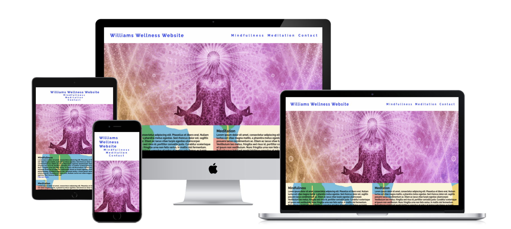
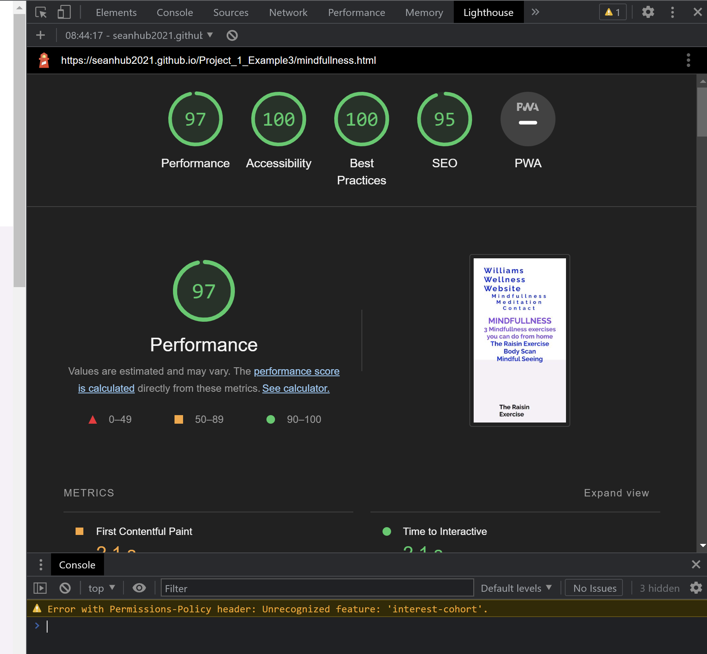

*********************
# Williams Wellness Website

Williams Wellness Website is a website that gives users to an introduction to Mindfullness & Meditation techniques & benefits. The website also has a section for customers to get in contact with them for more information about their Mindfulness & Meditation courses & mentoring. 

 



## Features 

### Site wide
* Navigation Menu
* Contains links to the Home, Mindfullness, Meditation, & Contact pages and will be responsive on all devices.
* This will allow users to easily navigate between the pages within the site on any size device. 


* Footer
    * This contains icons as links to social media websites that will open in new tabs. 
    * This will allow the user to follow 'Williams Wellness Website' on various social media where they can get more up to date information that may not be displayed on the website.
    * Icons are  accessible to the visually impaired using screen readers by the use of aria labels. 
    * These currently link off to the homepage for each social media site, but would be changed to appropriate business-specific links in practise. 


* 404 Page
    * A 404 page will be implemented and will display if a user navigates to a broken link.
    * The 404 page needs to be properly added.


### Landing Page
* Landing page image
    * This will help to immediately show the user what the website is about, and where the navigation elements are.
    * This will be an introductory page to the ideas of mindfulness & meditation
    


* Website information on 'Mindfulness' & 'Meditation'
    * Information about 'Mindfulness', which links to further content page for Mindfulness
    * Information about 'Meditation', which links to further content page for Mindfulness 


* Contact form
    * A contact form will be implemented to allow users to contact the wellness center. The form will consist of the following fields and attributes: 
        * First Name (required, type=text)
        * Last Name (required, type=text)
        * Email (required, type=email)
        * Mobile (required, type=mnumber)
        * Further info classes; Mindfulness, Meditation, or Both (required, type=radio)
    * On successful submission of the contact form, the user will be navigated to formdump.html displaying a success message.
    * The business will follow up directly with customers to build out a bespoke Mindfulness and/or Meditation class and/or tutoring package to suit their availability and budget. 


### Mindfullness Page
* Mindfullness
    * The Mindfulness page gives users 3 introductory forms of Mindfulness (The Raisin Exercise, The Body Scan, & Mindful Seeing), with basic technique information, as well as embedded youtube video content for users to watch at their leisure. 
    * There is also a call-to-action at the bottom of the page to redirect to the contact submission form. 


### Meditation Page
* Meditation
    * The Meditation page gives users 3 introductory forms of Meditation with basic technique information, as well as embedded picture content for users to understand how to position themselves for their chosen technique. 
    * There is also a call-to-action at the bottom of the page to redirect to the contact submission form. 
    


### Existing Features

* Responsive design; works on different sized devices
* Contact form and success page
* 3 mindfulness examples, with video content
* 3 meditation examples, with video content

### Features Left to Implement

* Contact form to submit to real database in practise

## Design

### Wireframes
- Add in to readme if time permitting

## Technologies

* HTML
    * The structure of the Website was developed using HTML as the main language.
* CSS
    * The Website was styled using custom CSS in an external file.
* Visual Studio Code
    * The website was developed using Visual Studio Code IDE
* GitHub
    * Source code is hosted on GitHub and delpoyed using Git Pages.
* Git 
    * Used to commit and push code during the development opf the Website
* Font Awesome
    * Icons obtained from https://fontawesome.com/ were used as the Social media links in the footer section. 
* Tinyjpg
    * https://tinyjpg.com/ was used to reduce the size of the images used throughout the website
* Youtube
    * video content hosted on youtube, embedded with youtubes iframe


## Testing 


### Responsiveness

All pages were tested to ensure responsiveness on screen sizes from 800px and upwards as defined in [WCAG 2.1 Reflow criteria for responsive design](https://www.w3.org/WAI/WCAG21/Understanding/reflow.html) on Chrome, Edge, Firefox and Opera browsers.

Steps to test:

1. Open browser and navigate to [Williams Wellness Website](https://seanhub2021.github.io/Project_1_Example3/mindfullness.html)
2. Open the developer tools (right click and inspect)
3. Set to responsive and decrease width to 800px
4. Set the zoom to 50%
5. Click and drag the responsive window to maximum width

Expected:

Website is responsive on all screen sizes and no images are pixelated or stretched, no video content becomes warped or unresponsive.
No horizontal scroll is present.
No elements overlap.

Actual:

Website behaved as expected. 

Website was also opened on the following devices and no responsive issues were seen:

- iPhone 12
- Samsung Galaxy s22 Ultra

### Accessibility

[Wave Accessibility](https://wave.webaim.org/) tool was used throughout development and for final testing of the deployed website to check for any aid accessibility testing.

Testing was focused to ensure the following criteria were met:

- All forms have associated labels or aria-labels so that this is read out on a screen reader to users who tab to form inputs
- Color contrasts meet a minimum ratio as specified in [WCAG 2.1 Contrast Guidelines](https://www.w3.org/WAI/WCAG21/Understanding/contrast-minimum.html)
- Heading levels are not missed or skipped to ensure the importance of content is relayed correctly to the end user
- Content is contained within landmarks (ie; "main") to ensure ease of use for assistive technology, allowing the user to navigate by page regions
- HTML page lang attribute has been set
- Aria properties have been implemented correctly
- WCAG 2.1 Coding best practices being followed

Manual tests (listening to page reader) was also performed to ensure the website was accessible as possible and any accessibility issues were identified. 


### Lighthouse Testing



### Functional Testing

**Navigation Links**

Testing was performed to ensure all navigation links on the respective pages, navigated to the correct pages as per design. This was done by clicking on the navigation links on each page.

| Navigation Link           | Page to Load          |
| --------------------------| ----------------------|
| Williams Wellness Center  | index.html            |
| Mindfulness               | mindfulness.html      |
| Meditation                | meditation.html       |
| Contact                   | contact.html          |


Links on all pages navigated to the correct pages as expected.

Testing was done to make sure the hover element displayed a line when Nav elements were selected with the cursor.

**Form Testing**

The form on the home page was tested to ensure it functioned as expected when correct data was input and when incorrect data was input. The following test scenarios were covered:

Steps to test:

1. Navigate to [Contact](https://seanhub2021.github.io/Project_1_Example3/contact.html)
2. Scroll down to the form and input any data 
3. Click Submit
4. User should be redirected to contact.html confirmation page

Expected:

Form submits with no warnings or errors and user is redirected to contact.html confirmation page.

Actual:

Website behaved as expected with no errors or warnings and redirected to contact.html.

_Scenario Two - Missing Required Field First Name_

Steps to test:

1. Navigate to [Contact](https://seanhub2021.github.io/Project_1_Example3/contact.html)
2. Scroll down to the form and input any data, but dont input data to the First Name field.
3. Click Submit
4. User should be prevented from submitting their content until data entry issue is fixed. 

Expected:

The form does not submit and an Error is displayed to tell the user that the field is required.

Actual:

Website behaved as expected, error message was displayed and the form did not submit.

_Scenario Three - Not enough characters input to mnumber

Steps to test:

1. Navigate to [Contact](https://seanhub2021.github.io/Project_1_Example3/contact.html)
2. Scroll down to the form and input any data, but only 3 characters for Mobile Number
3. Click Submit
4. User should be prevented from submitting their content until data entry issue is fixed. 

Expected:

The form does not submit and an Error is displayed to tell the user that the field is required.

Actual:

Website behaved as expected, error message was displayed and the form did not submit.

**Footer Social Media Icons / Links**

Testing was performed on the Font Awesome Social Media icons in the footer to ensure that each one opened in a new tab and that each one had a hover effect of underlining.

Each item opened a new tab when clicked as expected and correct underlining was present. 

### Validator Testing 

- HTML
  - No errors were returned when passing through the official [W3C validator](https://validator.w3.org)


- CSS
  - No errors were found when passing through the official [(Jigsaw) validator]()


### Unfixed Bugs
Responsiveness of the website worked on all devices, screen sizes and orientation.

## Deployment

### Version Control

The site was created using the Visual Studio code editor and pushed to github to the remote repository ‘tacos-travels’.

The following git commands were used throughout development to push code to the remote repo:

```git add <file>``` - This command was used to add the file(s) to the staging area before they are committed.

```git commit -m “commit message”``` - This command was used to commit changes to the local repository queue ready for the final step.

```git push``` - This command was used to push all committed code to the remote repository on github.

### Deployment to Github Pages

- The site was deployed to GitHub pages. The steps to deploy are as follows: 
  - In the GitHub repository, navigate to the Settings tab 
  - From the menu on left select 'Pages'
  - From the source section drop-down menu, select the Branch: main
  - Click 'Save'
  - A live link will be displayed in a green banner when published successfully. 

The live link can be found here - https://gareth-mcgirr.github.io/tacos-travels/ 

### Clone the Repository Code Locally

Navigate to the GitHub Repository you want to clone to use locally:

- Click on the code drop down button
- Click on HTTPS
- Copy the repository link to the clipboard
- Open your IDE of choice (git must be installed for the next steps)
- Type git clone copied-git-url into the IDE terminal

The project will now of been cloned on your local machine for use.

## Credits 

* [Accordion without javascript](https://supfort.com/pure-css-accordion-without-javascript)
    * Code was used from this site to create the accordian effect on the adventures page sections for the hidden sections for each days travels. Styles were changed to suit styling on my Website.
* [Youtube Gallery Filter Tutorial](https://www.youtube.com/watch?v=U-CujW5OlW0)
    * Gallery page was created with inspiration from this video. I adapted code to use flexbox rather than css grid to make the page responsive on every device. 


### Content 

All content with the exception of those listed in the Media section of this document was owned by Williams Wellness Website business owner William. Permission was granted from rights holders for the images.  .

### Media

Video content was uploaded to Youtube by x/y/z channel names.